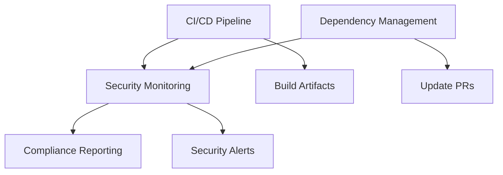

# GitHub Workflows Documentation

This document provides a comprehensive overview of all GitHub Actions workflows implemented for the USAi API Node.js module. These workflows ensure security, compliance, and reliability for government agencies using this open-source project.

## Table of Contents

- [Overview](#overview)
- [CI/CD Pipeline](#cicd-pipeline)
- [Security Monitoring](#security-monitoring)
- [Dependency Management](#dependency-management)
- [Government Compliance](#government-compliance)
- [Workflow Integration](#workflow-integration)
- [Troubleshooting](#troubleshooting)

## Overview

The USAi API project includes three main workflow categories:

1. Continuous Integration/Continuous Deployment - Automated testing and validation
2. Security Monitoring - Daily security scanning and vulnerability detection
3. Dependency Management - Weekly dependency updates and supply chain security

All workflows are designed with government security requirements and compliance standards in mind.

## CI/CD Pipeline

**File:** `.github/workflows/ci-cd.yml`

### Purpose
Comprehensive continuous integration and deployment pipeline that validates code quality, security, and functionality across multiple Node.js versions.

### Triggers
- Push to `main` branch
- Pull requests to `main` branch
- Manual workflow dispatch

### Jobs Overview

#### 1. Test Matrix (`test-matrix`)
- Node.js Versions: 16.x, 18.x, 20.x
- Operating System: Ubuntu Latest
- Coverage: Runs complete test suite with coverage reporting
- Artifacts: Test results and coverage reports (30-day retention)

#### 2. Security Scanning (`security-scan`)
- npm audit: Identifies known vulnerabilities
- Snyk Security: Advanced vulnerability scanning
- Dependency Review: Validates new dependencies for security

#### 3. Build Validation (`build`)
- TypeScript Compilation: Ensures clean builds
- ESLint: Code quality and style checking
- Prettier: Code formatting validation
- Package Integrity: Validates package.json and lock files

#### 4. Government Compliance (`government-compliance`)
- License Validation: Ensures government-compatible licensing
- Documentation Review: Validates required documentation
- Security Policy Check: Confirms security.md presence
- API Compliance: Validates government API standards

#### 5. Notification (`notification`)
- Failure Alerts: Notifies on workflow failures
- Status Reporting: Provides detailed status summaries
- Government Context: Includes agency-specific recommendations

### Key Features
- Multi-version Node.js testing
- Comprehensive security scanning
- Government compliance validation
- Automated failure notifications
- Detailed reporting and artifacts

### Sample Output
```
Tests: 22/22 passing across Node 16, 18, 20
Security: No vulnerabilities detected
Compliance: Government standards met
Build: Successful TypeScript compilation
```

## Security Monitoring

**File:** `.github/workflows/security.yml`

### Purpose
Daily security monitoring and vulnerability detection to maintain ongoing security posture for government deployments.

### Schedule
- Daily: 6:00 AM UTC
- Manual: On-demand execution
- Event-driven: On security-related file changes

### Security Checks

#### 1. Vulnerability Audit (`security-audit`)
- npm audit: Comprehensive vulnerability scanning
- Severity Assessment: Critical/High/Medium vulnerability categorization
- Remediation Guidance: Actionable fix recommendations
- Government Impact: Agency-specific risk assessment

#### 2. License Compliance (`license-compliance`)
- License Scanning: Validates all dependency licenses
- Government Compatibility: Ensures federal agency compliance
- FOSS Policy: Validates open-source usage policies
- Risk Assessment: Identifies potential licensing conflicts

#### 3. Secret Detection (`secret-detection`)
- TruffleHog: Advanced secret scanning
- API Key Detection: Identifies exposed credentials
- Government Sensitive Data: Scans for classified patterns
- Historical Analysis: Reviews commit history for leaks

#### 4. Dependency Analysis (`dependency-analysis`)
- Supply Chain Security: Analyzes dependency publishers
- Trust Verification: Validates package integrity
- Risk Scoring: Assesses supply chain risks
- Government Vetting: Reviews against agency allowlists

#### 5. Code Quality Security (`code-quality-security`)
- SAST Analysis: Static application security testing
- Best Practices: Validates secure coding standards
- Government Guidelines: Ensures compliance with federal standards
- Risk Mitigation: Identifies security technical debt

#### 6. Compliance Summary (`compliance-summary`)
- Daily Reports: Comprehensive security status
- Trend Analysis: Security posture over time
- Action Items: Prioritized remediation tasks
- Government Dashboard: Agency-ready security metrics

### Alerting
- Critical Issues: Immediate notification
- High Priority: Daily summary
- Trends: Weekly analysis
- Compliance: Monthly reporting

## Dependency Management

**File:** `.github/workflows/dependency-management.yml`

### Purpose
Automated dependency updates and supply chain security management with government-specific review processes.

### Schedule
- Weekly: Wednesdays at 10:00 AM UTC
- Event-driven: Changes to package.json
- Manual: On-demand execution

### Management Jobs

#### 1. Dependency Updates (`dependency-update`)
- Update Detection: Identifies available updates
- Security Prioritization: Focuses on security patches
- Automated PRs: Creates pull requests for updates
- Government Review: Includes agency-specific checklists

#### 2. Vulnerability Monitoring (`vulnerability-monitoring`)
- Real-time Scanning: Continuous vulnerability detection
- **Impact Assessment:** Evaluates government deployment risks
- **Compliance Tracking:** Monitors against security baselines
- **Escalation Procedures:** Automated critical issue handling

#### 3. Supply Chain Security (`supply-chain-security`)
- **Package Verification:** Validates package signatures
- **Publisher Analysis:** Reviews maintainer trustworthiness
- **Dependency Tree:** Analyzes supply chain depth
- **Government Vetting:** Cross-references agency allowlists

#### 4. Compliance Summary (`compliance-summary`)
- **Dependency Health:** Overall security posture
- **Government Recommendations:** Agency-specific guidance
- **Action Items:** Prioritized update tasks
- **Documentation:** ATO-ready security reports

### Update Process
1. 🔍 **Scan:** Weekly dependency analysis
2. 🔒 **Security:** Prioritize security updates
3. 📝 **PR Creation:** Automated pull requests
4. 👀 **Review:** Government-specific checklists
5. ✅ **Approval:** Agency review and merge

## Government Compliance

### Federal Standards Alignment

All workflows align with key government standards:

- **NIST Cybersecurity Framework**
- **FedRAMP Security Requirements**
- **FISMA Compliance Standards**
- **GSA Digital Services Playbook**
- **OMB Memoranda on Open Source**

### Agency Integration

#### Authority to Operate (ATO) Support
- Security documentation generation
- Vulnerability tracking and remediation
- Compliance evidence collection
- Risk assessment reporting

#### Continuous Monitoring
- Real-time security posture
- Automated compliance checking
- Audit trail maintenance
- Incident response integration

#### Supply Chain Risk Management
- Vendor assessment automation
- Dependency security validation
- Software composition analysis
- Third-party risk evaluation

## Workflow Integration

### Workflow Dependencies


### Data Flow
1. **Code Changes** → CI/CD Pipeline
2. **Security Scans** → Monitoring Dashboard
3. **Dependencies** → Update Management
4. **Compliance** → Government Reporting

### Artifact Management
- **Test Results:** 30-day retention
- **Security Reports:** 90-day retention
- **Compliance Evidence:** 1-year retention
- **Dependency Analysis:** 30-day retention

## Troubleshooting

### Common Issues

#### CI/CD Pipeline Failures
```bash
# Check test failures
npm test -- --verbose

# Verify TypeScript compilation
npm run build

# Validate code formatting
npm run lint
npm run format:check
```

#### Security Scan Failures
```bash
# Review vulnerabilities
npm audit

# Fix security issues
npm audit fix

# Check for secrets
# Review TruffleHog output in workflow logs
```

#### Dependency Update Issues
```bash
# Check outdated packages
npm outdated

# Review security advisories
npm audit

# Validate package integrity
npm ci
```

### Emergency Procedures

#### Critical Vulnerability Response
1. 🚨 **Immediate:** Disable affected functionality
2. 📞 **Notify:** Alert government security teams
3. 🔧 **Patch:** Apply emergency fixes
4. 📋 **Document:** Update security reports
5. ✅ **Verify:** Confirm fix effectiveness

#### Workflow Failure Escalation
1. 📊 **Analyze:** Review workflow logs
2. 🔍 **Diagnose:** Identify root cause
3. 🛠️ **Fix:** Apply appropriate solution
4. 🧪 **Test:** Validate fix effectiveness
5. 📝 **Document:** Update troubleshooting guide

### Support Resources

- **GitHub Actions Documentation:** [actions/docs](https://docs.github.com/en/actions)
- **Node.js Security Guide:** [nodejs.org/security](https://nodejs.org/en/security/)
- **Government Development:** [code.gov](https://code.gov)
- **NIST Guidelines:** [nist.gov/cybersecurity](https://www.nist.gov/cybersecurity-framework)

## Workflow Maintenance

### Regular Reviews
- **Monthly:** Security configuration updates
- **Quarterly:** Compliance standard alignment
- **Annually:** Complete workflow architecture review

### Update Procedures
1. Test workflow changes in feature branches
2. Review security implications
3. Validate government compliance
4. Document changes thoroughly
5. Monitor post-deployment metrics

---

**Maintained by:** USAi API Development Team  
**Last Updated:** August 22, 2025  
**Version:** 1.0.0  
**Compliance:** FedRAMP, FISMA, NIST Framework
